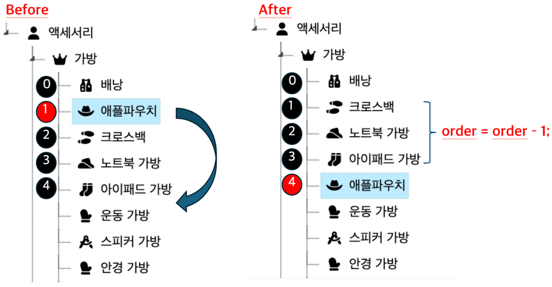

# 메뉴 관리

### 개발 배경
- 고객사 서버에 따라 메뉴를 다르게 구성해야하는 경우가 자주 생김.
- 메뉴 데이터는 순서가 있고, 계층구조로 되어 있어서, 매번 DB 쿼리를 만드는 데 불편함이 있음.
- 관리자 계정으로 메뉴를 관리할 수 있는 페이지가 필요함.

### 요구사항
- 트리 형태로 전체 메뉴를 볼 수 있어야함
- 드래그 앤 드롭으로 순서/계층구조 조정
- 폼을 통한 메뉴 생성/수정 가능해야함

### 조건
- 메뉴는 순서가 있다.
- 메뉴는 계층구조 이다.
- 메뉴의 쓰기 작업은 관리자 권한이 필요하다.

### 순서를 update할 때 쿼리 수를 줄이는 방법에 대한 고민
- 메뉴의 순서는 중복될 수 없다. -> 메뉴 순서 하나가 이동하면 나머지 메뉴도 이동할 수 있다.
- 순서가 바뀔 때 한칸 씩 밀리는 order 수정은 벌크 연산으로 수행하기.

---

1. [전체 메뉴 구조를 트리로 표현](https://velog.io/@honey153/jsTree%EB%A5%BC-%EC%82%AC%EC%9A%A9%ED%95%9C-%EB%A9%94%EB%89%B4-%EA%B4%80%EB%A6%AC-%ED%8E%98%EC%9D%B4%EC%A7%80-%EA%B0%9C%EB%B0%9C-1)

2. [드래그 앤 드롭 API 구현](https://velog.io/@honey153/jsTree%EB%A5%BC-%EC%82%AC%EC%9A%A9%ED%95%9C-%EB%A9%94%EB%89%B4-%EA%B4%80%EB%A6%AC-%ED%8E%98%EC%9D%B4%EC%A7%80-%EA%B0%9C%EB%B0%9C-2)

